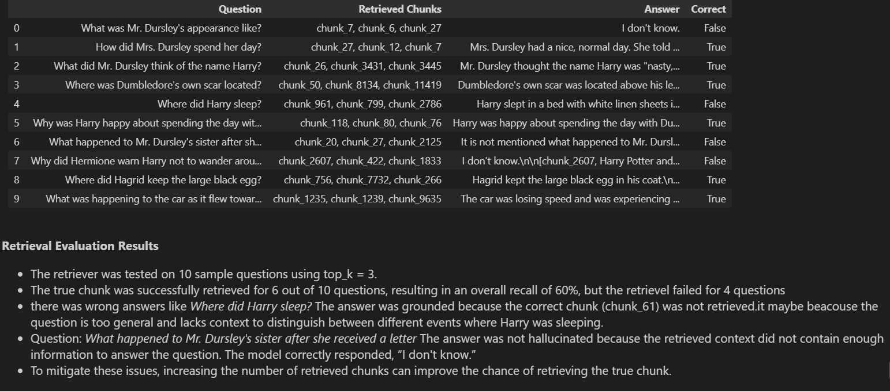

## Overview
This project is a **RAG assistant system** that allows users to ask questions about the Harry Potter books and receive answers based on the retrieved content from the books
The project includes a RAG pipeline, a FastAPI backend, and simple streamlit application
The system processes the book content, splits it into meaningful chunks, generates vector embeddings, and stores them in a vector database When the user asks a question, the system retrieves the most relevant *top_k* chunks and uses them as context to generate an answer
The project provides a FastAPI backend for handling the RAG pipeline and an interactive frontend for users to submit questions and view the generated answers

## Architecture
User --> Ask question --> Frontend --> post Request --> FastAPI --> Embedding --> Retrieval --> ChromaDB --> Prompt contain context and query --> LLM --> get answer --> Display

## Tech Stack
- **Language:** Python
- **Backend:** FastAPI
- **Frontend:** Streamlit
- **Text Processing:** NLTK
- **Embeddings:** Sentence Transformers (`intfloat/multilingual-e5-small`)
- **Vector Database:** ChromaDB
- **LLM:** llama

## Project Structure

rag-assistant-project/
   - backend/                     
           1. app/                *contain fast api files and logic*
           2. tests
           3. .env.example
   - document/
           1. harry potter        *Raw Data*
   - Frontend/
           1. app.py              *Streamlit file*
           2. api_client.py       *function to make post request*
           3. requirements.txt
   - notebooks/
           1. content.md          *turn raw data into one markdown file*
           2. rag_pipeline.ipynb  *pipeline --> reading,spliting,chunks,embedding,...*
           3. requirements.txt
    - README.md
    - requirements.txt

## Domain
The project uses a corpus containing the seven Harry Potter books. The books are provided together in a single PDF document
The corpus includes:

Harry Potter and the Sorcerer's Stone
Harry Potter and the Chamber of Secrets
Harry Potter and the Prisoner of Azkaban
Harry Potter and the Goblet of Fire
Harry Potter and the Order of the Phoenix
Harry Potter and the Half-Blood Prince
Harry Potter and the Deathly Hallows

The PDF content is processed and divided into smaller semantic chunks while preserving the corresponding page information. These chunks are converted into embeddings and stored in the vector store used by the retrieval system

## Setup

1. Clone the Repository
- git clone https://github.com/Mohamed-Ramadan81/rag-assistant-app.git
- cd rag-assistant-app

2. Create a virtual environment then activate it

- Python version= 3.11.0.
- make sure u downloaded loacl ollama

- python -m venv .venv
- .venv\Scripts\activate

3. Install all packages from requirement.txt (careful its size around **6gb**)
- pip install -r requirements.txt

4. Environment Variables

> The backend and frontend provides an .env.example file containing the required environment variables replace it by yours 

5. generate the vectorDB
> Open the **RAG notebook** and run all cells from top to bottom
> The generated vector store will be stored in: backend/data/vector_store/

6. Start the FastAPI Backend
From the project root start the FastAPI server using:
- cd backend
- uvicorn app.main:app --reload

7. Start the Streamlit Frontend
From the project root start the Streamlit app using:
- cd frontend
- streamlit run app.py

The Streamlit application will open in your browser.
before using streamlit app make sure the FastAPI server is running

## API Reference
The Project has two **endpoints**:

1. GET /health
> doesn't expect any input
>Response: { "status": "application is working" }

2. POST /query
>expect a Query Request like:{"question": "What business did Mr. Dursley manage?" }
>Response: {"answer": "The answer generated by the RAG assistant", "sources": [] }

## Evaluation
